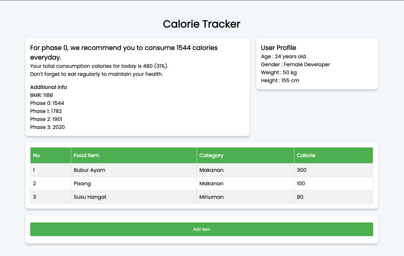

# CALORIE TRACKER

### Objective
- Mampu memecahkan masalah yang diberikan
- Mampu mengakses data pada array dan data pada array of object
- Mampu membuat object serta object multi dimensi
- Mampu membuat array serta array of object
- Mengerti cara melemparkan data yang dikembalikan dari satu function kemudian digunakan sebagai parameter function lain.
- Mampu membuat element HTML sederhana dan memberikan styling melalui _external CSS_
- Mampu mengimplementasikan DOM

### NOTES

- Jalankan `npm install` terlebih dahulu
- Pada skeleton terdapat folder `__tests__`, folder ini beserta file-file di dalamnya tidak boleh diubah sama sekali.
- untuk menjalankan test untuk memastikan solusi kamu sudah benar, jalankan command `npm test`

### RESTRICTION

- Hanya boleh menggunakan built-in function untuk menambahkan atau mengurangi data dalam array, seperti `shift()`, `unShift()`, `push()`, dan `pop()`

### HINTS

- Nama function haruslah `calculateBMR`, `getRecommendedCalories`, `generateFoodDrink`, `calculateCalories`, `calculateCaloriePercentage`
dan `dashboardOverview` dan __tidak boleh diganti dengan nama function lainnya__. Untuk detail fungsi akan mengacu kepada [Directions](##directions) yang disebutkan di bawah
- Jangan menghapus, comment ataupun mengedit bagian module.exports dibagian bawah
- Kerjakan solusi kamu pada file `index.js` terlebih dahulu.
---

## Directions

Pada challenge kali ini, kalian diberikan sebuah file `index.html`, `index.js`, dan `style.css`, ketiga file ini bertujuan untuk menampilkan sebuah website sederhana. Website ini bertujuan untuk menampilkan kalori harian yang dibutuhkan seseorang yang sedang mengikuti _programming bootcamp_. Selain itu website ini juga akan menampilkan daftar makanan dan minuman yang sudah di konsumsi `<todayConsumptions>` pada hari ini. Website ini menggunakan styling dari file `style.css` yang memiliki beberapa class yang dapat diterapkan pada element html. Tapi jika kamu mau menambahkan styling sesuai selera kamu sangat dipersilahkan. 🥳

<br>

### Release 1 - `calculateBMR`
Pada function ini akan menerima satu parameter yaitu `user` yang bertipe data **object**. Dimana function ini berfungsi untuk menghitung  _basal metabolic rate_ seseorang dengan rumus sebagai berikut:
  - Male BMR = (10 * W) + (6.25 * H) - (5 * A) + 5
  - Female BMR = (10 * W) + (6.25 * H) - (5 * A) - 161
  - W adalah berat badan (_weight_)
  - H adalah tinggi badan (_height_)
  - A adalah umur (_age_)
  - Gunakan `Math round` untuk nilai output

Output dari function ini bertipe data **number**. Perhatikan contoh berikut:
```js
function calculateBMR(user){
  // your code here
}

console.log(calculateBMR({ age: 27, gender: "male", weight: 60, height: 165, phase: 0 })); // 1501

console.log(calculateBMR({ age: 24, gender: "female", weight: 50, height: 155, phase: 0 })); // 1188
// Penjelasan: 1188 karena di bulatkan menggunakan Math round.
```


<br>

### Release 2 - `getRecommendedCalories`
Pada function ini akan menerima satu parameter yaitu `bmr` yang bertipe data **number**. Dimana function ini berfungsi untuk menghasilkan daftar rekomendasi kalori untuk phase_0, phase_1, phase_2, phase_3 berdasarkan bmr dengan rumus sebagai berikut:
  - Phase 0 = 1.3 * BMR
  - Phase 1 = 1.5 * BMR
  - Phase 2 = 1.6 * BMR
  - Phase 3 = 1.7 * BMR
  - Gunakan `Math round` untuk nilai di semua key  

Output dari function ini bertipe data **object**. Perhatikan contoh berikut:
```js
function getRecommendedCalories(bmr){
  // your code here
}

console.log(getRecommendedCalories(1501));
/*
{
  bmr: 1501,
  phase_0: 1951,
  phase_1: 2252,
  phase_2: 2402,
  phase_3: 2552
}
*/

console.log(getRecommendedCalories(1188));
/*
{
  bmr: 1188,
  phase_0: 1544,
  phase_1: 1782,
  phase_2: 1901,
  phase_3: 2020
}
*/
```

<br>

### Release 3 - `generateFoodDrink`
Pada function ini akan menerima satu parameter yaitu `arrOfString` yang bertipe data **array of string**. Dimana function ini berfungsi untuk merubah data array of string menjadi array of object.

Note:
- Pola element pada parameter adalah `"kategori, nama_makanan, kalori"`.
- Sedangkan pola element output adalah `{ name: <string>, calorie: <number>, category: <string> }`.
- Jika kategori adalah 'Makan' maka value untuk key `category` dalam elemen output diubah menjadi 'Makanan'
- Jika kategori adalah 'Minum' maka value untuk key `category` dalam elemen output diubah menjadi 'Minuman'

Output dari function ini bertipe data **array of object**. Perhatikan contoh berikut:
```js
function generateFoodDrink(arrOfString){
  // your code here
}

const todayConsumptions = [
  "Makan, Bubur Ayam, 300",
  "Makan, Pisang, 100",
  "Minum, Susu Hangat, 80",
];

console.log(generateFoodDrink(todayConsumptions));
/*
[
  { name: 'Bubur Ayam', calorie: 300, category: 'Makanan' },
  { name: 'Pisang', calorie: 100, category: 'Makanan' },
  { name: 'Susu Hangat', calorie: 80, category: 'Minuman' }
]
*/
```

<br>

### Release 4 - `calculateCalories`
Pada function ini akan menerima satu parameter yaitu `listOfFoodDrink` yang bertipe data **array of object**. Dimana function ini berfungsi untuk menghitung total kalori dari list makanan dan minuman yang sudah dikonsumsi.

Output dari function ini bertipe data **number**. Perhatikan contoh berikut:
```js
function calculateCalories(listOfFoodDrink){
  // your code here
}

const listItem = [
  { name: 'Bubur Ayam', calorie: 300, category: 'Makanan' },
  { name: 'Pisang', calorie: 100, category: 'Makanan' },
  { name: 'Susu Hangat', calorie: 80, category: 'Minuman' }
];

console.log(calculateCalories(listItem)); // 480
```

<br>

### Release 5 - `calculateCaloriePercentage`
Pada function ini akan menerima tiga parameter yaitu: `calories` yang bertipe data **object**, `user` yang bertipe data **object** dan `calorieConsumed` yang bertipe data **number**. Dimana function ini berfungsi menghitung persentase total kalori yang sudah dikonsumsi (`calorieConsumed`) terhadap kalori harian yang direkomendasikan (`calories` data yang di dapatkan dari release 2) berdasarkan status phase user. Gunakan `Math round` untuk nilai output.

Output dari function ini bertipe data **number**. Perhatikan contoh berikut:
```js
function computeCaloriePercentage(calories, user, calorieConsumed){
  // your code here
}

const caloriesData = { bmr: 1188, phase_0: 1544, phase_1: 1782, phase_2: 1901, phase_3: 2020 };
const caloriesConsumed = 480;
const userProfile = { age: 24, gender: "female", weight: 50, height: 155, phase: 0 };
console.log(computeCaloriePersentage(caloriesData, userProfile, caloriesConsumed)); // 31
```
Output `31` di dapatkan dari `480 / 1544 * 100` karena status user adalah phase `0`.

<br>

### Release 6 - `dashboardOverview`
Yey, sudah hampir selesai ya! 🥳
Jadi dengan memanggil function ini halaman website kita nanti akan memperoleh data yang diperlukan untuk ditampilkan kepada user. Pada funtion ini akan menerima dua parameter yaitu: `userProfile` dan `todayConsumptions`.
- Parameter `userProfile` bertipe data **object** berisi informasi umur (`age`), gender (`gender`), berat badan (`weight`), tinggi badan (`height`), dan status user berada di phase berapa (`phase`).
- Parameter `todayConsumption` bertipe data **array of string** yang setiap elemennya direpresentasikan sebagai informasi makanan atau minuman yang sudah dikonsumsi oleh user.

**Tugas kamu adalah untuk membuat object yang berisi:**
1. Status user berada di phase berapa,
2. Rekomendasi kalori harian (untuk tiap phase dan BMR),
3. Daftar makanan dan minuman yang sudah dikonsumsi hari ini (berbentuk array of object),
4. Total kalori yang sudah dikonsumsi user,
5. Persentase total kalori yang sudah dikonsumsi terhadap kalori harian yang direkomendasikan berdasarkan phase user,
6. Dan pesan yang diberikan kepada user berdasarkan pesentase tadi dengan ketentuan sebagai berikut:
   - persentase di bawah 80 = `Don't forget to eat regularly to maintain your health.`
   - persentase 80 sampai 120 = `Nice! Your diet is in a safe range.`
   - persentase di atas 120 = `You've eaten too much for today.`

Jangan lupa untuk menggunakan semua function-function yang sudah kamu buat sebelumnya di dalam function ini. 😎

Output dari function ini bertipe data **object**. Perhatikan contoh berikut:
```js
function dashboardOverview(userProfile, todayConsumptions){
  // your code here
}

const todayConsumptions = [
  "Makan, Bubur Ayam, 300",
  "Makan, Pisang, 100",
  "Minum, Susu Hangat, 80",
]
const userProfile = { age: 24, gender: "female", weight: 50, height: 155, phase: 0 };
console.log(dashboardOverview(userProfile, todayConsumptions));
/*
{
  phase: 0,
  recommendedCalories: {
    bmr: 1188,
    phase_0: 1544,
    phase_1: 1782,
    phase_2: 1901,
    phase_3: 2020
  },
  userConsumption: [
    { name: 'Bubur Ayam', calorie: 300, category: 'Makanan' },
    { name: 'Pisang', calorie: 100, category: 'Makanan' },
    { name: 'Susu Hangat', calorie: 80, category: 'Minuman' }
  ],
  totalCalorieConsumed: 480,
  percentage: 31,
  message: "Don't forget to eat regularly to maintain your health."
}
*/
```

<br>

### Release 7 - Put it in HTML 🎉🎉🎉
Dengan memindahkan semua function yang sudah kamu kerjakan ke dalam file `script.js` maka website kita sudah sudah selesai. Tapi ternyata masih ada bug nih.🐛 Karena data user belum muncul pada website. Jadi tugas kamu pada release 7 ini adalah menampilkan data user menggunakan DOM. Kamu boleh menambahkan styling CSS pada file `style.css` dan mengubah layout untuk mempercantik tampilan websitenya.

<br>

**Kerjakan release 7 pada file `script.js`**

Berikut adalah contoh hasil akhir tampilan websitenya.

<p align="center">
  
</p>
