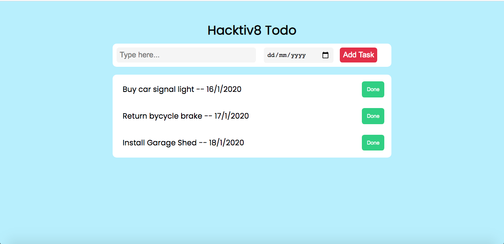
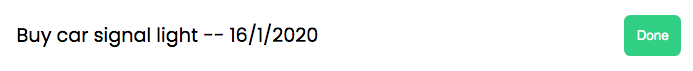

# TODO LIST

### NOTES

- Jalankan `npm install` terlebih dahulu
- Pada skeleton terdapat folder `__tests__`, folder ini beserta file-file di dalamnya tidak boleh diubah sama sekali.
- untuk menjalankan test untuk memastikan solusi kamu sudah benar, jalankan command `npm test`

### RESTRICTION

- Hanya boleh menggunakan built-in function untuk menambahkan atau mengurangi data dalam array, seperti .shift(), unShift(), push(), dan pop() dan built-in function untuk mengakses isi dalam object seperti for..in, for...of, Object.keys(), dll

### HINTS

- Nama function  __tidak boleh diganti dengan nama function lainnya__. Untuk detail fungsi akan mengacu kepada [Directions](#directions) yang disebutkan di bawah

---

## Objectives
- Mampu mengakses array multidimensi atau array of objects
- Mampu membuat array of objects
- Mampu memberikan styling yang tepat untuk elemen html
- Mampu mengimplementasikan DOM
- Mampu Mengimplementasikan Modular Function

## Directions

Pada challenge kali ini, kalian diberikan sebuah file `index.html`, `index.js`, dan `style.css`, ketiga file ini bertujuan untuk menampilkan sebuah website sederhana, website ini menampilkan konten `Todo List` yang ada pada file `index.js`, dan juga website ini menggunakan styling dari file `style.css` yang memiliki beberapa class yang dapat diterapkan pada element html.

Tugas kalian ada 4 yaitu:

-   pada file `index.js` diberikan sebuah variable `todos` yang berbentuk array 2 dimensi, tiap element arraynya memiliki 2 value, yaitu index ke-0 memiliki value `task`, dan index ke-1 memiliki value `due date`. didalam array `todos` ada beberapa element yang tidak memiliki value `due date`, tugas kalian adalah melakukan filter terhadap `todos`, dimana kalian hanya mengambil `task` yang memiliki `due date` saja, setelah itu ubahlah array 2 dimensi tersebut menjadi `array of object`, tiap object didalam array tesebut memiliki key `task` dan `dueDate` (key dalam object harus sesuai dengan yang diminta soal), buatlah  function `filterTodos` untuk memfilter `task` yang tidak memiliki `due date` dan function `createObject` untuk mengubah array 2 dimensi menjadi array of object, gunakan metode modular function untuk mengerjakan challenge ini.

-   pada file `index.html` terdapat beberapa element html yang belum memiliki properti styling, carilah style yang tepat pada file `style.css`, lalu masukan class styling yang ada di `style.css` pada element html yang kalian anggap tepat, bila penempatan stylingnya benar maka akan muncul beberapa `task` pada halaman website seperti gambar dibawah ini.
    
- kemudian disamping kanan task tersebut ada sebuah tombol `done`, apabila tombol ini diklik maka background color dari task tersebut akan berubah warna menjadi hijau, namun tombol ini belum berfungsi seperti yang diharapkan, tugas kalian adalah membuat tombol ini berfungsi sebagaimana mestinya, styling yang digunakan untuk background hijau tersebut sudah tersedia di file `style.css`, gunakan DOM untuk memanipulasi class pada element html tersebut.

    ### tombol done sebelah kanan

    

    ### ketika tombol done diklik

    

-   pada website ini ada sebuah form yang berfungsi untuk menambahkan task pada todo list, pada file `index.js` lengkapilah function `addTodo` sehingga akan memunculkan alert apabila tidak ada input dan tanggal due date yang dimasukan pada saat user ingin  menambahkan task.
